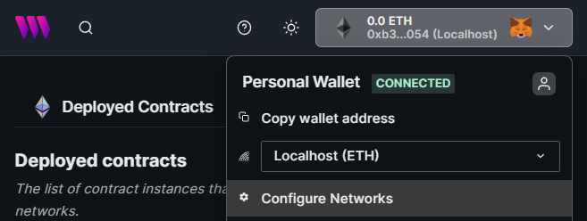
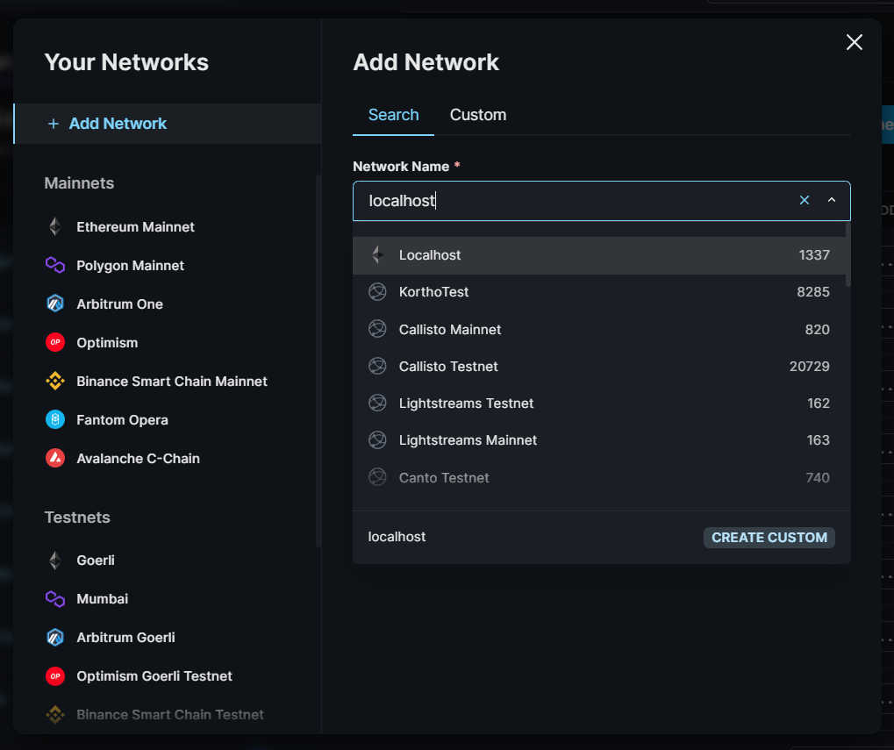
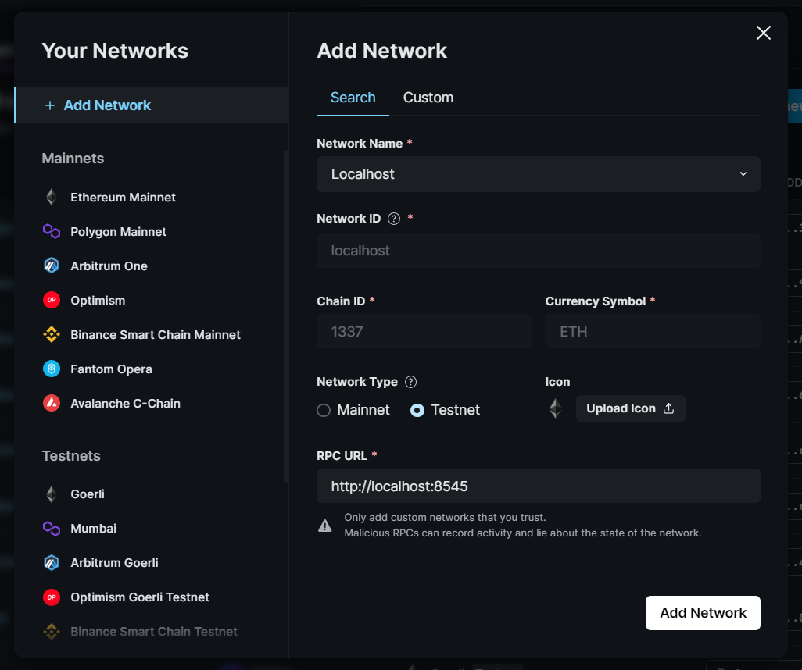
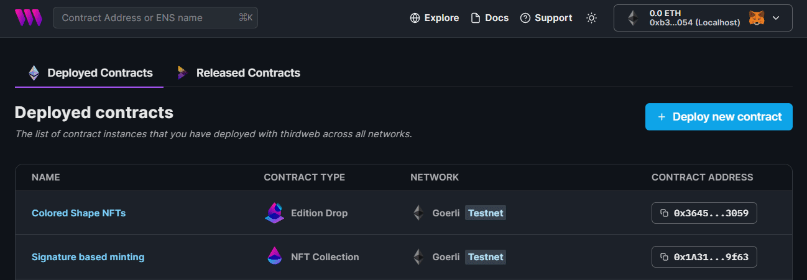

# Hardhat Local Node with thirdweb

Use the [React SDK](https://portal.thirdweb.com/react) to interact with smart contracts deployed to a
[local Hardhat node](https://hardhat.org/hardhat-runner/docs/guides/deploying).

The code is split into two directories:

1. `contracts`: Contains the smart contracts and the scripts to deploy to a local node.
2. `application`: Contains the React application that interacts with the smart contracts.

## Setup

Clone this repository using the [CLI](https://portal.thirdweb.com/cli).

```bash
npx thirdweb create --template hardhat-local-node
```

Install the dependencies for the project, in both the `contracts` and `application` directories.

```bash
cd application
npm install

cd ../contracts
npm install
```

### Running a local node

Use the `hardhat` CLI to [run a local node](https://hardhat.org/hardhat-runner/docs/getting-started#connecting-a-wallet-or-dapp-to-hardhat-network).

```bash
# From within the /contracts directory
npx hardhat node
```

### Deploy smart contracts to the local node

Use the `hardhat` CLI to [deploy the smart contracts](https://hardhat.org/hardhat-runner/docs/guides/deploying) to the local node.

```bash
# From within the /contracts directory
npx hardhat run scripts/deploy.js --network localhost
```

Running this script will print out the addresses of the deployed contracts to the console.

### Import contracts to the dashboard

From the [dashboard](https://thirdweb.com/dashboard), first add the `Localhost` chain to your settings.

First, connect your wallet and click `Configure networks`.



Search "Localhost" and click on the `Localhost` chain.



Click `Add Network`.



Close the modal now and paste your contract address into the search bar.

Click the result on `Localhost`.



Then, import the contracts to the dashboard using the `thirdweb` CLI.

That's it! You can now interact with your smart contracts from the dashboard and the React application.

### Interact with the smart contracts

Use the [React SDK](https://portal.thirdweb.com/react) to interact with them from within the `application` directory; which is a Next.js application.

In the `_app.tsx` file, wrap the application with the `ThirdwebProvider` component and set the `activeChain` prop to `Localhost`.

```tsx
// application/pages/_app.tsx
function MyApp({ Component, pageProps }: AppProps) {
  return (
    <ThirdwebProvider activeChain={Localhost}>
      <Component {...pageProps} />
    </ThirdwebProvider>
  );
}

export default MyApp;
```

Now, you can use the `useContract` hook to interact with the smart contracts, as you can see on the `index.tsx` file.

```tsx
const { contract, isLoading, error } = useContract(
  "0x5FbDB2315678afecb367f032d93F642f64180aa3"
);
```
