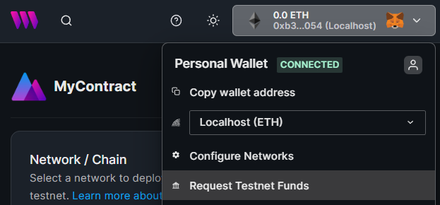
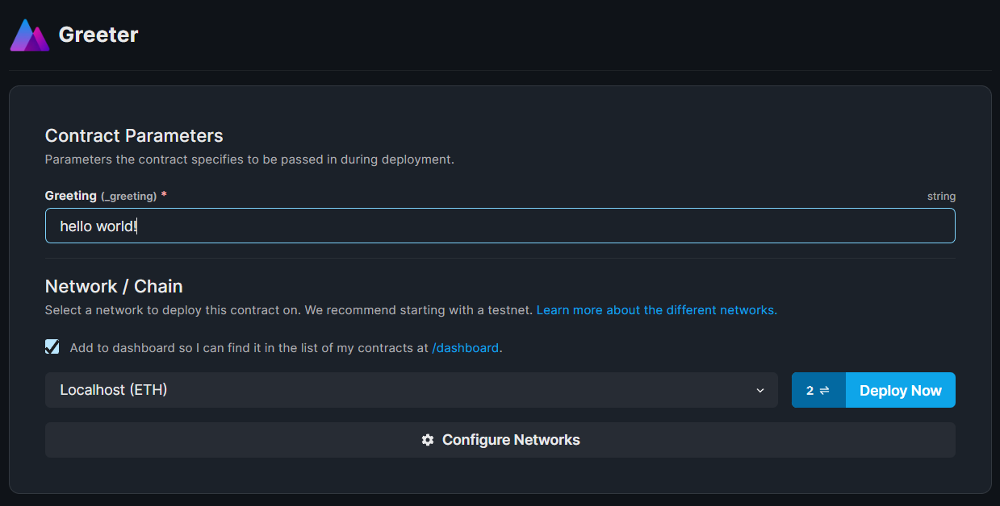
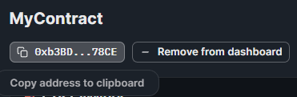

# Hardhat Local Node with thirdweb

Use the [React SDK](https://portal.thirdweb.com/react) to interact with smart contracts deployed to a
[local Hardhat node](https://hardhat.org/hardhat-runner/docs/guides/deploying).

The code is split into two directories:

1. `contracts`: Contains the smart contracts and the scripts to deploy to a local node.
2. `application`: Contains the React application that interacts with the smart contracts.

## Setup

Clone this repository using the [CLI](https://portal.thirdweb.com/cli).

```bash
npx thirdweb create --template hardhat-local-node
```

Install the dependencies for the project, in both the `contracts` and `application` directories.

```bash
cd application
npm install

cd ../contracts
npm install
```

### Running a local node

Use the `hardhat` CLI to [run a local node](https://hardhat.org/hardhat-runner/docs/getting-started#connecting-a-wallet-or-dapp-to-hardhat-network).

```bash
# From within the /contracts directory
npx hardhat node
```

### Deploy the smart contracts

Use the [CLI](https://portal.thirdweb.com/cli) to deploy the smart contracts to the local node via the [dashboard](https://portal.thirdweb.com/dashboard).

```bash
# From within the /contracts directory
npx thirdweb deploy
```

This command compiles your contract and produces a link to the [dashboard](https://portal.thirdweb.com/dashboard) where you can deploy the contract to a local node.

Use the `Request testnet funds` button to load your wallet with some funds to deploy the contract.



Ensure to select the `Localhost (ETH)` network and click on the `Deploy` button!



Once deployed, copy your contract address from the dashboard:



Paste it in the `application/pages/index.tsx` file, within the `useContract` hook.

```jsx
const Home: NextPage = () => {
  const { contract, isLoading, error } = useContract(
    // Your contract address here!
    "0x..."
  );
};

export default Home;
```

## Join our Discord!

For any questions, suggestions, join our discord at [https://discord.gg/thirdweb](https://discord.gg/thirdweb).
